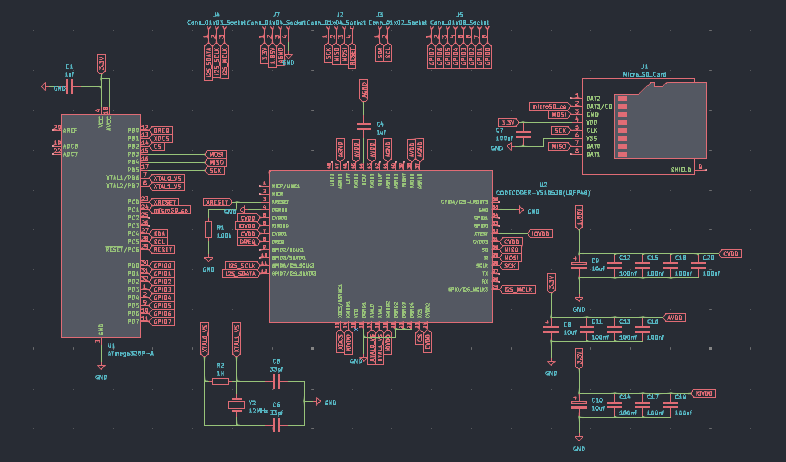
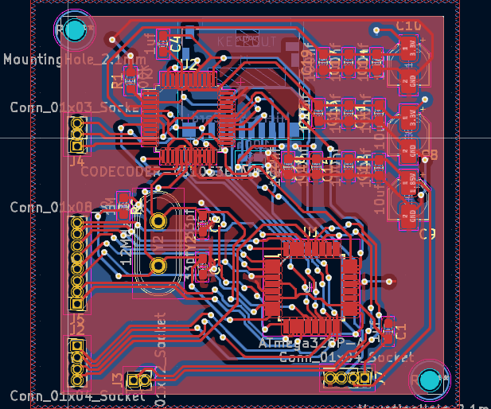
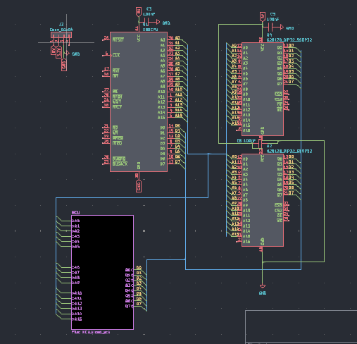
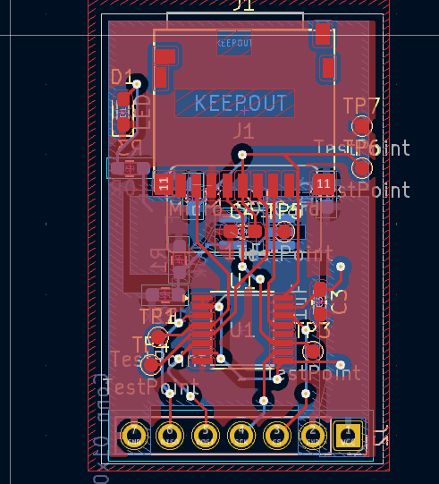
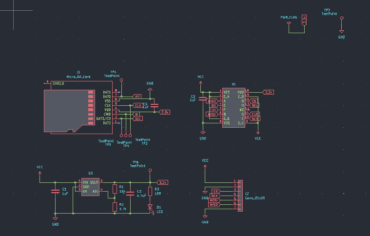

These are all hardware projects I've done over the years, these designs taught me the basics of schematic design and PCB design. Here are some descriptions on each project

# FLAT_MOBO

This project was an attempt at creating a MP3 player design. This project made use of vs1053b codec chip that would take audio data streamed to it via a SPI connection and output a analog audio signal to speakers, the chip could also be used in conjunction with a external microcontroller for addiotional features. This project was a predessor to OTTO, a project that I would persue on later that shared a simiar theroy of operation.

# PIPBOY

this project was an attempt to redesign a gameboy with a Z80 computer instead of it's original hardware. This project also made use of a prototype gameboy emulator that I wanted to build to help me understand the hardware better. Here's a schematic that includes the computer's data and address bus connected to a sram package and a custom prehphrial that would act as a simulated cartridge.

# SD_P

A microSD card breakout board, a way to tinker with a SD card using hardware of my own desgin. A BOM was constructed detailing all parts, cost of each part, and links where to get them. Overall a very simple project.
